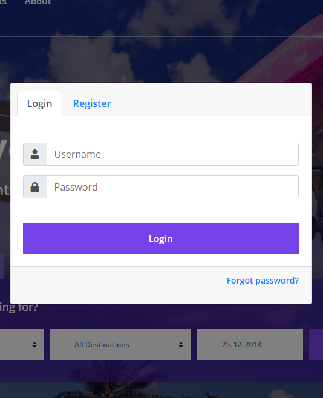

User Documentation Implemented by Selim Enes Kılıçaslan
=======================================================

Register
--------

.. figure:: ../../Images/Register.png
  :scale: 100%
  :alt: Register Form
  :align: center
  
  Fill the required fields to register.
  
Login
-----

  
  Enter your username and password to login.
  
Forgot Password
---------------

  
  Your password will be sent to your email address.
  
Edit Profile
---------------

  
  Enter the values you want to change.
  
Buy Coins
---------------

  
  Enter the amount of SCoins you want to buy.