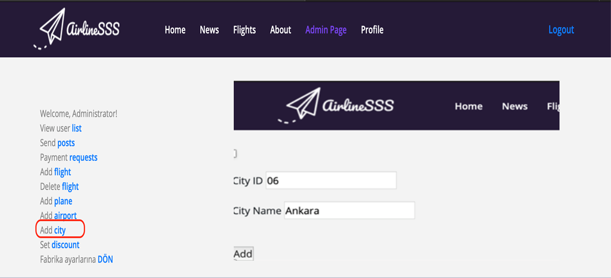
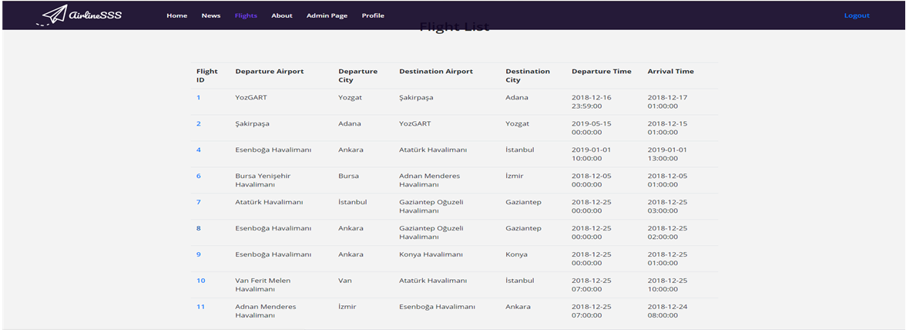
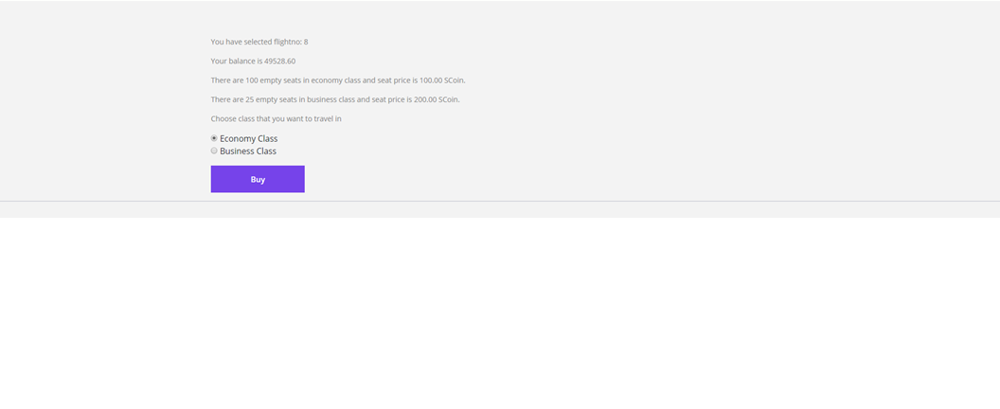
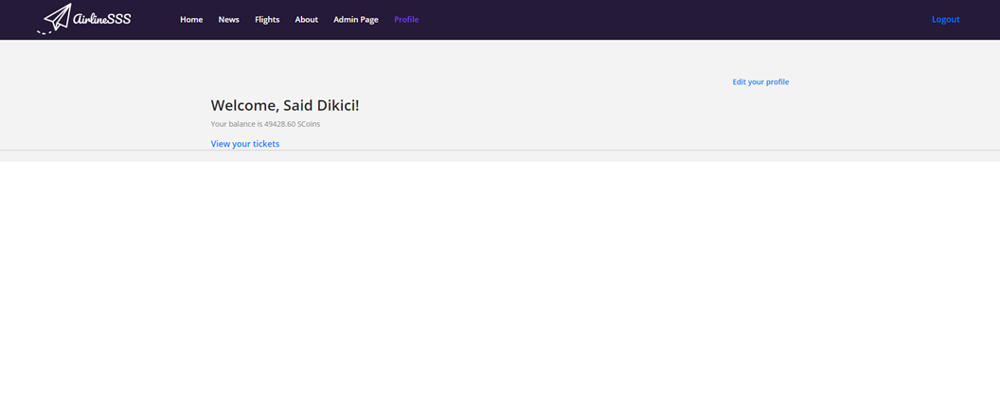
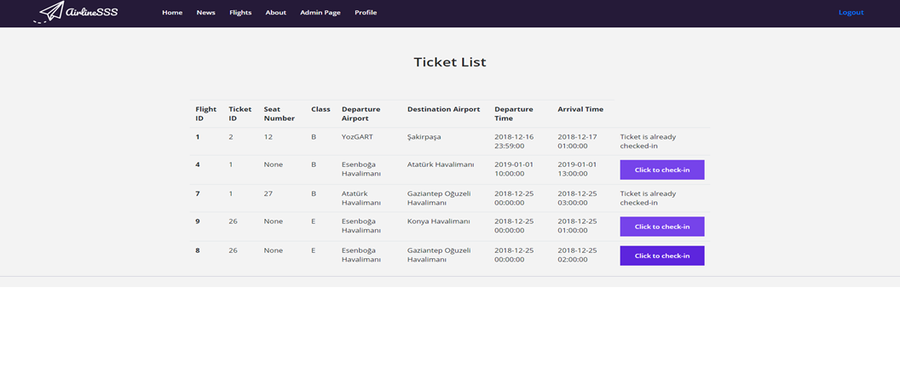
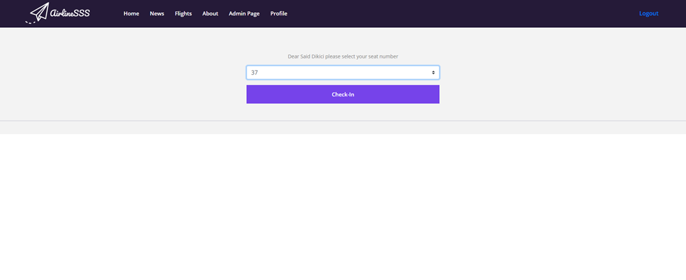
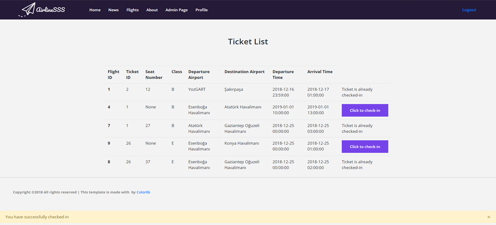

Parts Implemented by Muhammed Said Dikici
=========================================

Add City
--------

Admins can add a city from admin panel with city ID and city name.

Selecting a flight from Flight List
-----------------------------------

User can select his/her flight from Flight List by clicking Flight ID.

Buy Ticket Page
---------------

After selecting flight user can buy his/her ticket after selecting class(economy or business) by clicking buy button.

Bought Notification
-------------------
.. image:: Images/ticket_bought.png
  :scale: 100 %
  :width: 750px
  :height: 450px
  :alt: Bought_ticket

After buying a ticket a notification shows up at the bottom of the page saying buying was successful or not.

View Your Tickets Button
------------------------

From profile page user can see his/her balance and view his/her tickets by clicking View your tickets button.

Ticket List
-----------

At the ticket list page user can see his/her tickets' information including check-in status.

 
Check-in Page
-------------

  
By clicking check-in button from view tickets page user goes to check-in page. From that page user can select his/her seat number and complete the check-in process.

Checked-in
----------

After selecting seat number user can click the check-in button, after that a notification shows up and says either check-in was successful or not.
