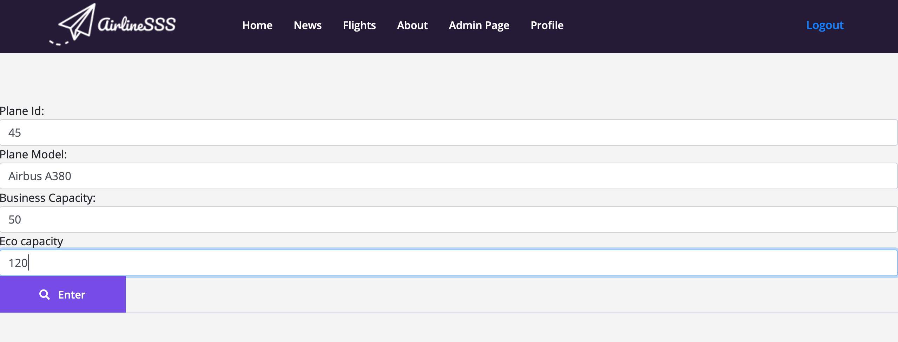
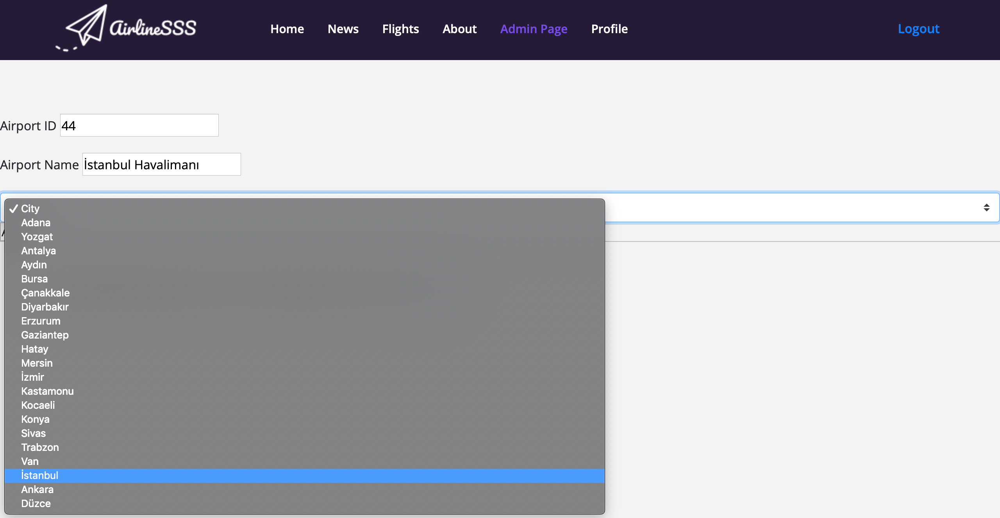
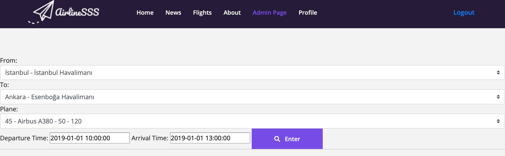
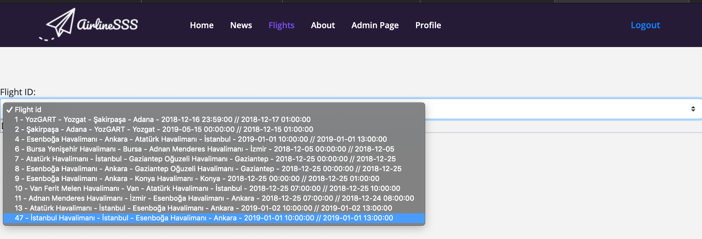
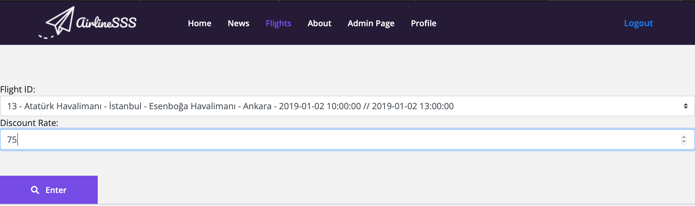
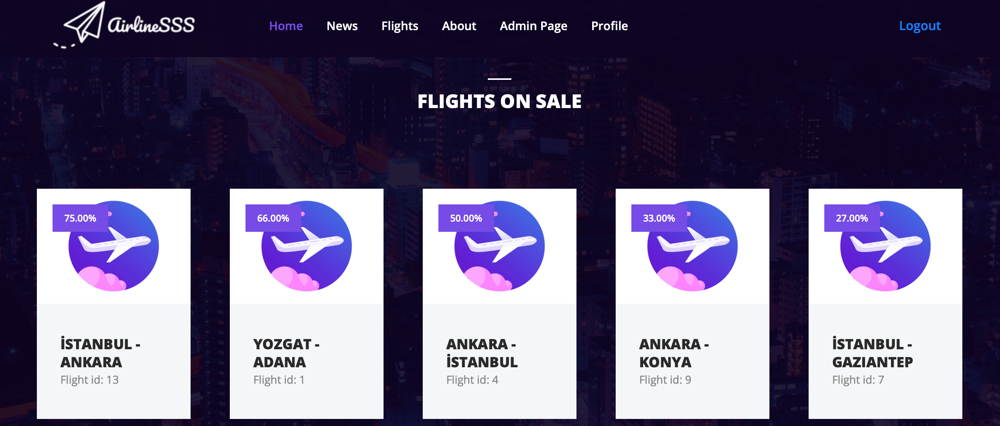
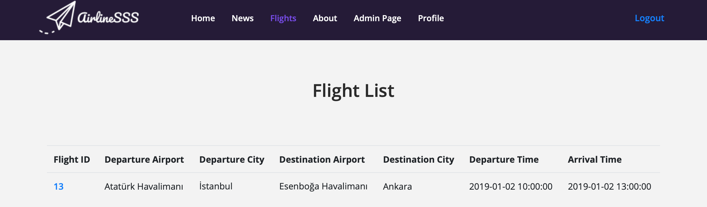
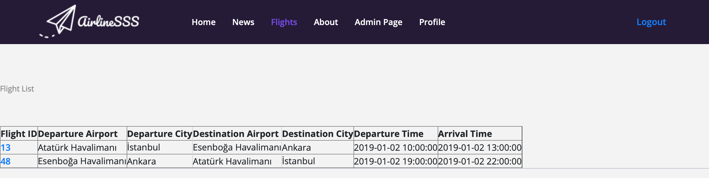

Parts Implemented by Sercan Yetkin
==================================

Add Plane
---------

Plane id, plane model, business and economy capacity are required attributes to add a plane.You can see the related code below.

.. literalinclude:: /../../server.py
   :language: python
   :linenos:
   :lines: 152-180

Add Airport
-----------

After adding city into cities table, if you are an admin, you can add airport into airports table.You can see the related code below.

.. literalinclude:: /../../server.py
   :language: python
   :linenos:
   :lines: 211-253

Add Flights
-----------

Adding flight is the main focus on my part. So after all cities, planes and airports tables are created, you can add a flight.You can see the related code below.

.. literalinclude:: /../../server.py
   :language: python
   :linenos:
   :lines: 770-823

List All Flights
----------------
.. image:: Images/flight_list.png
  :scale: 100 %
  :width: 750px
  :height: 450px
  :alt: List_flights

By clicking the Flights button on the bar, you can see all the flights.You can see the related code below.

.. literalinclude:: /../../server.py
   :language: python
   :linenos:
   :lines: 92-112

Delete Flights
--------------

To delete a flight, you can choose a flight from delete flights menu on admin page.You can see the related code below.

.. literalinclude:: /../../server.py
   :language: python
   :linenos:
   :lines: 826-876

Set discount for a flight
-------------------------

To update discount for a flight, you should just select a flight and then enter a discount rate.After updating, you can see the discounted flights on the main page.You can see the related code below.

.. literalinclude:: /../../server.py
   :language: python
   :linenos:
   :lines: 255-308
   
   

Search oneway flight
--------------------

To search a oneway flight, you can enter the information destination, departure and the date. You will see the list of flights matches to entered data.You can see the related code below.

.. literalinclude:: /../../server.py
   :language: python
   :linenos:
   :lines: 66-90

Search roundtrip flight
-----------------------
.. image:: Images/roundtrip.png
  :scale: 100 %
  :width: 750px
  :height: 450px
  :alt: Roundtrip

To search roundtrip flight, you can enter the information destination, departure and the date. You will see the list of roundtrip flights matches to entered data.You can see the related code below.

.. literalinclude:: /../../server.py
   :language: python
   :linenos:
   :lines: 114-150

